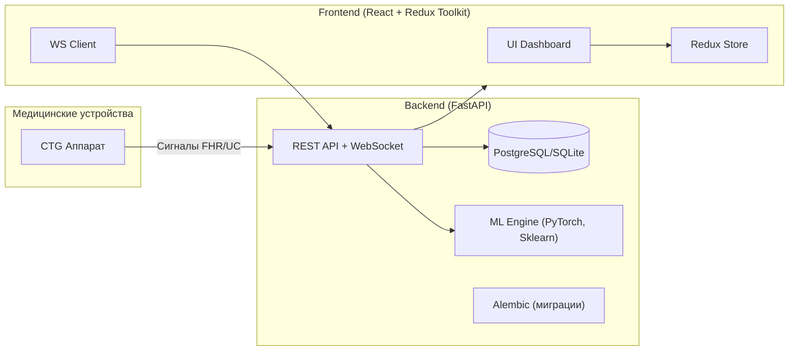

# Лидеры Цифровой Трансформации 2025 | Решение команды МИСИС Два Миллиона

Веб-сервис предиктивной аналитики физиологических данных с интеграцией в медицинское оборудование.

## Основные ссылки
- [Ссылка на рабочий прототип](https://localhost/)
- [Скринкаст работы сервиса](https://localhost/)

## Архитектура

### Сервисы

#### Веб-интерфейс мониторинга

Выступает главным сервисом для взаимодействия с медицинским персоналом через **удобный интерфейс мониторинга КТГ**, построенном на WebSocket соединении. Позволяет в реальном времени отслеживать физиологические показатели плода, получать предупреждения о патологических состояниях и сохранять историю исследований.\
*В дальнейшем функционал может расширяться для интеграции с различными медицинскими системами и кастомизации.*

**[Документация к сервису мониторинга](https:///docs)**


#### Основное API

Реализует все методы для **получения предсказаний** и **формирования отчетов по КТГ**. В качестве протокола общения наше API предоставляет **HTTP REST API** и **WebSocket**, что позволяет легко интегрировать сервис в любую внешнюю медицинскую систему или использовать как самостоятельное решение.

**[Документация к api](http://127.0.0.1:8000/docs)**

#### ML Engine

Сервис для обработки **физиологических сигналов в реальном времени**. Реализует алгоритмы анализа кардиотокографии, включая прогнозирование риска гипоксии плода, анализ вариабельности сердечного ритма (STV) и классификацию по стандартам FIGO. Использует обученные модели CatBoost и scikit-learn для обеспечения высокой точности диагностики.

#### Streaming Service

Все данные от медицинского оборудования проходят через сервис потоковой обработки, который **принимает сигналы FHR и UC, обрабатывает их в реальном времени и передает результаты анализа**. Данные автоматически фильтруются и анализируются с использованием пороговых значений и ML-моделей.\




## Инструкция по локальному запуску

*Рекомендуем использовать наш [прототип](https://front.lct2025.ln-kr.ru/).*

*Для запуска требуется утилита **poetry** и **python 3.12**.*\
\
*Все пути ниже указаны от корня директории **lct2025-backend**.*

```bash
1. git clone https://github.com/your-org/lct2025-backend && cd lct2025-backend
2. настройка переменных окружения и конфигураций
    2.1. .env # пример в .env.example
    2.2. настройка базы данных в переменных окружения
3. poetry install
4. настройка ML моделей
    4.1. убедиться что файлы model_hypoxia_config.pkl и model_stv_config.pkl находятся в src/app/modules/ml/infrastucture/services/
5. настройка базы данных
    5.1. выполнить миграции: alembic upgrade head
6. poetry run python -m app.main
```

## ML

### Стек технологий

Python, scikit-learn, CatBoost, Pandas, NumPy

### Преимущества

1) Реальное время обработки сигналов КТГ с минимальной задержкой
2) Высокая точность прогнозирования риска гипоксии плода
3) Автоматическая классификация по стандартам FIGO
4) Анализ вариабельности сердечного ритма (STV) с прогнозированием до 10 минут вперед
5) Обнаружение патологических паттернов (тахикардия, брадикардия, акцелерации, децелерации)
6) Интеграция с медицинским оборудованием через удобный интерфейс
7) Безопасность медицинских данных пациентов

### Архитектура ML


### Реализация

Система обрабатывает два основных типа сигналов:
- **FHR (Fetal Heart Rate)** - частота сердечных сокращений плода
- **UC (Uterine Contractions)** - сокращения матки

Что делали мы:  
Обучались на реальных данных КТГ с различными патологическими состояниями. Используем комбинацию пороговых алгоритмов для быстрого обнаружения критических состояний и ML-моделей для более точного анализа и прогнозирования.

### Signal Processing

#### Real-time Analysis

**Модель для анализа сигналов в реальном времени**  
Поскольку КТГ данные поступают непрерывно, мы используем скользящее окно для анализа последних 600 секунд данных. Это позволяет обнаруживать патологические паттерны в реальном времени.

#### Hypoxia Prediction

**Модель для предсказания риска гипоксии**  
Используем CatBoost модель, обученную на исторических данных КТГ с исходами гипоксии плода. Модель анализирует комбинацию факторов: базовую частоту сердечных сокращений, вариабельность, наличие акцелераций и децелераций.

#### STV Forecasting

**Прогнозирование краткосрочной вариабельности**  
Используем CatBoost модель, обученную на ретро данных на непрерывной переменной STV в будущем, для прогнозирования STV на 3, 5 и 10 минут вперед. Это помогает врачам предвидеть изменения в состоянии плода намного раньше.

#### Pattern Recognition

**Обнаружение патологических паттернов**  
Пороговые алгоритмы для обнаружения:
- Тахикардии (>160 уд/мин)
- Брадикардии (<110 уд/мин)  
- Акцелераций (повышение ЧСС на >15 уд/мин)
- Децелераций (снижение ЧСС на >15 уд/мин)

#### FIGO Classification

**Классификация по стандартам FIGO**  
Автоматическая классификация состояния плода согласно международным стандартам FIGO на основе анализа всех параметров КТГ.

## Backend

### Стек технологий

- **Python**: основной язык, на котором написан сервис
- **FastAPI**: современный веб-фреймворк для создания высокопроизводительных API
- **SQLAlchemy**: ORM для работы с базой данных
- **WebSocket**: протокол для передачи данных в реальном времени
- **Alembic**: система миграций базы данных
- **Dishka**: система внедрения зависимостей
- **Pydantic**: валидация данных и сериализация

### Преимущества

Благодаря модульной архитектуре, основной функционал нашего решения может быть легко интегрирован в существующие медицинские системы или использоваться как самостоятельное решение.

В качестве протокола общения используется HTTP REST API и WebSocket, что позволяет быстро создать интеграции с различными медицинскими системами и устройствами.

Был сделан большой упор на безопасность и соответствие медицинским стандартам:

- данные пациентов изолированы и защищены в локальной сети
- че та еще надо
- написать
- тут

## Frontend

### Стек технологий

- **TypeScript**: Статическая типизация для JavaScript.
- **React**: Компонентная библиотека для создания UI.
- **Redux Toolkit**: Управление состоянием приложения.
- **VisX/D3**: Библиотеки для создания интерактивных графиков КТГ.


## Состав команды

- **[Степан Пискунов](https://t.me/parkiev)** - backend, captain
- **[Григорий Исупов](https://t.me/domster704)** - frontend  
- **[Андрей Кадомцев](https://t.me/avenircs)** - ML
- **[Светлана Шубина](https://t.me/gleamhaze)** - design, product manager

---
